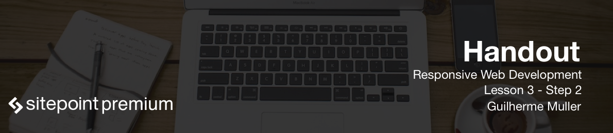

Let's learn how to install the software needed for an automated front end work flow for a website. We'll need to install two main tools: NPM, the Node.js package manager that comes with the Node.js server, and Gulp, the build tool that we'll be using throughout the course. First, head to [nodejs.org](http://nodejs.org) and download the install package for NodeJS. When installing on Windows be sure to add the main executable to the Windows path.

After NodeJS is installed run

```
node -v
```

to check whether Node is installed properly. This will output the version of the NodeJS installation on your computer.

With that out of the way we can start using NPM. NPM is a huge repository for JavaScript software. And it can download all sorts of packages right from the command prompt or terminal. Installing a package globally will install the package in your system so you can use its commands. For example, we need to run gulp in the command line so we should install it globally. Also you can install packages locally. This is important if you want to require or load packages inside the project. As we need to use both the gulp command and require it inside our project, we'll install Gulp both globally and locally.

Let's start with a global installation. The command is

```
npm install gulp -g
```

If you are in Windows you may need to run the command prompt as an administrator. If you are using macOS you may get a permission error. You can use the `sudo` command to install package globally, and while it works, many developers say that's not the best idea.

After installing gulp use the `cd` command to change to the folder you created for the website. On Windows you can usually see the folder where you're at. In a Unix terminal, if you are unsure, you can type the `pwd` command or print working directory. 

Before you install Gulp locally, it's important to create an essential file when you work with projects that use NPM: the *package.json* file. That is a file in JSON or a JavaScript Object Notation that has some information on the project including which packages are being used. This is very useful if you're sharing the project or working with collaborators. We don't share the installed packages because it can become a huge folder - we only share this file and when another developer wants to work on this website he can download the regular website's files along with the *package.json* file. Then run the `npm install` command, which will install the necessary packages or dependencies.

To create a *package.json* file just run the `npm`. NPM will ask you for some information. The values in parenthesis are the default values read from your project. If you don't want to change it just press `Enter`. NPM will ask you for the project's name, version, description, entry point, which is something we'll not use so leave it like that.

Run this command to install Gulp locally: `npm install gulp --save-dev`. The `save-dev` flag tells NPM to update our *package.json* file, which can be seen here. The absence of the `-g` flag specifies that we want a local installation.

We now have NodeJS, NPM and Gulp installed globally and locally as well as the *package.json* file!
