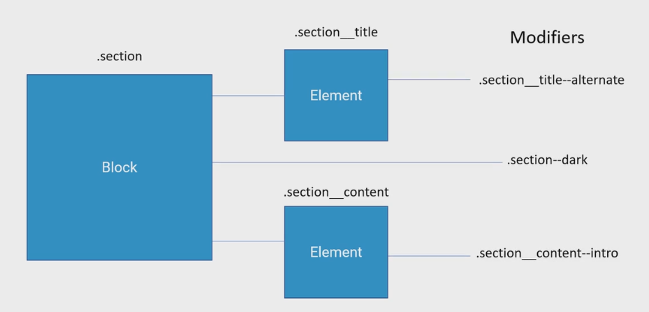
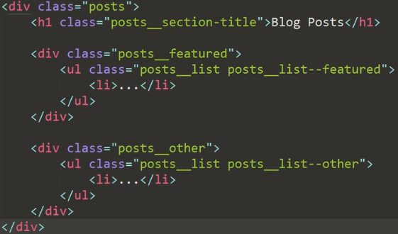

We now have the Gulp workflow up and running and we are almost ready to begin coding the HTML of the website. Before we start however, I would like to take a moment and introduce you to the class name methodology that we use throughout the course. With increasing complexity and the need to organize front end development.

Many companies and professionals begin creating methodologies to better link HTML, CSS and JavaScript through structure naming practices. CSS class names are particularly important as they are part of the HTML code using the class attributes of the text. 

If you have developed a number of websites, especially medium to large ones, you'll have noticed that an unplanned naming convention can get out of control pretty quickly when the website grows and other sections and modules are added.

The **BEM methodology**, created by Yandex aims to solve this problem and can be used not only for CSS class naming but for a file and folder structure for example. Let's see what it's all about and why we are going to use in in this course.

BEM stands for Block Element Modifier, which already describe the parts that compose the system. In BEM you name blocks, which are independent and reusable blocks of content. The blocks can contain elements which, no matter the HTML nesting, should be treated as the elements directly linked to the main block. The modifiers are, like the name says, classes that indicate that they're modifying the block or the elements. It's a simple but powerful system.

A simple BEM structure for the same markup would look like this:

If you're not used to the BEM syntax, at first glance it may look verbose and ugly. And yes, I thought of that at first as well. But the benefits are much bigger than the aesthetics here. With BEM the relationship between each stack is much clear. You almost always style each element by selecting it just by it's classes. Maintaining CSS specificity and conflicts very low. One of the principles of BEM, is to encapsulate it and separate each block and it's styles from the other. Avoiding general styles that influence everything on the page.

There are a lot of other methodologies available. I think that BEM is the simplest and most easy to use right away, but there are others worth mentioning. So we can do your own research and make your choice: Object oriented CSS, SMACSS, SUITCSS, and Atomic CSS. There are even those developers that mix and modify these existing ideas. The important thing is to settle for a system that you're comfortable working with. With this brief presentation, we are ready to start decoding the HTML of the website.

