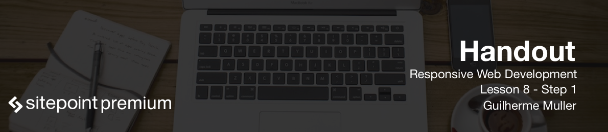

We have completed what we've set out to do in this course. What next?

First, there are a lot of Gulp plugins that can be added to the workflow:

* Gulp-useref reads our HTML files and tries to join separated CSS and JS files into one bundle each. You can control how each concatenated file is made.
* Gulp-uglify, it's a minifier plugin.
* Gulp-responsive, useful to generate different formats of images for responsive websites.
* Gulp-uncss, removes unnecessary CSS.
* Gulp-htmlmin, minifier for HTML files.

Second, there are some interesting layout techniques that you can study like flexbox and CSS Grid layout. Flexbox is well supported and can be used easily today. As for CSS grid layout, good support from all main browsers is still coming.

Based on all of that, here are some ideas that you can apply on the website we have just built:

* Add plugins to the Gulp workflow and optimize the website even more.
* Create a second grid system based on flexbox and use it along with the float-based one.
* Substitute in your own content to see how it looks like in this design.
* Add final touches like a favicon and a meta description tag.
* Make the contact form work with the languages like PHP or the other solutions presented earlier. As for this point in particular, one idea is to use a service like formspree.io which can make HTML forms functional without programming.

Web development can be tough with all the constant changes. The key is, as always, to never stop learning and practicing, especially in this field.

I hope that you have enjoyed the course, and maybe learned a thing or two that you can use in your daily work. Thank you for your attention and dedication and see you next time.

